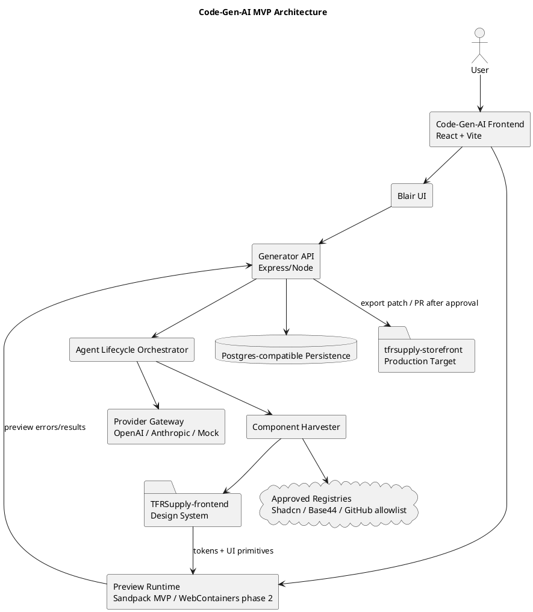

# SPEC-001-Code-Gen-AI Modular AI Coding Platform

## Background

Code-Gen-AI is a modular AI coding platform for generating React/Vite applications using a disciplined component-stitching workflow. It exists because raw “one-shot” LLM generation is unreliable for complex UI and hard to govern.

The platform uses **Blair**, a senior AI coding assistant personality, to orchestrate:

1. intent definition,
2. machine-readable planning,
3. base template selection,
4. component harvesting,
5. TFRS design-system adaptation,
6. live browser preview,
7. governed export into target repositories.

The ecosystem spans three repositories:

- `Code-Gen-AI` — generator app and Blair interface.
- `TFRSupply-frontend` — internal UI library and TFRS design-system source of truth.
- `tfrsupply-storefront` — production e-commerce and quoting platform.

## Requirements

### Must have

- M1. Blair must create a structured plan before code generation.
- M2. The generator must replace the static iframe with a live React preview.
- M3. The platform must harvest components from approved sources before custom UI generation.
- M4. Generated UI must follow the TFRS Tactical Command Deck design system.
- M5. The system must persist requests, plans, component manifests, generated files, preview sessions, verification runs, reviews, and exports.
- M6. LLM provider calls must run through a server-side gateway.
- M7. Generated UI must be previewable without production backend deployment.
- M8. All repo work must follow `develop -> feature/* -> PR -> main`.
- M9. AI-generated patches must trace back to plan IDs.
- M10. Security controls must protect provider keys, prompt data, generated code, and third-party component inputs.

### Should have

- S1. Support Sandpack previews first and WebContainers later.
- S2. Support pluggable providers: OpenAI, Anthropic, and mock/local providers.
- S3. Use provider-native structured output where available.
- S4. Generate artifact manifests for every file.
- S5. Provide rules for Claude, Cursor, and Copilot.
- S6. Include automated tests for plan validation, component adaptation, and preview boot.
- S7. Export as ZIP and Git patch.

### Could have

- C1. Component quality scoring using license, accessibility, maintenance, dependency weight, and design fit.
- C2. Visual diffing between generated preview and target design.
- C3. Retrieval index over internal TFRSupply components.
- C4. Template marketplace.
- C5. Multi-agent review.

### Won't have in MVP

- W1. Autonomous production deployment.
- W2. Arbitrary shell execution outside the browser preview sandbox.
- W3. Heavy UI frameworks by default.
- W4. Browser-side direct provider API calls.
- W5. Unreviewed commits to `main`.

## Method

### Architecture overview



### Core domains

| Domain | Responsibility |
|---|---|
| Intent capture | Normalize user request, constraints, target repo, and preview mode |
| Planning | Produce JSON plan with data model, routes, components, file manifest, risks, and checks |
| Component harvesting | Find and normalize existing components before generating custom UI |
| Design adaptation | Apply TFRS colors, typography, layout, and interactions |
| Code generation | Produce files against a known Vite/React template |
| Preview runtime | Boot generated code in-browser and capture errors |
| Verification | Run schema, lint, type, test, preview, and review gates |
| Export | Package files as ZIP, patch, or PR-ready branch bundle |

### Main lifecycle

```plantuml
@startuml
title Blair Agent Lifecycle

start
:DEFINE\nCapture intent and constraints;
:PLAN\nGenerate valid JSON plan;
if (Plan valid?) then (yes)
  :BUILD\nHarvest components and generate files;
  :VERIFY\nRun checks and preview smoke;
  if (Passed?) then (yes)
    :REVIEW\nHuman/AI checklist;
    if (Approved?) then (yes)
      :SHIP\nExport ZIP/patch/branch bundle;
    else (no)
      :Revise files or plan;
      back to BUILD;
    endif
  else (no)
    :Repair from failure context;
    back to BUILD;
  endif
else (no)
  :Revise plan;
  back to DEFINE;
endif
stop
@enduml
```

### MVP component choices

| Concern | MVP choice | Reason |
|---|---|---|
| Frontend | React + Vite | Existing standard |
| Styling | Tailwind with `clsx` and `tailwind-merge` | Matches TFRS/shadcn-style UI |
| UI primitives | Radix + Shadcn-style copied components | Accessible and locally auditable |
| Preview | Sandpack first | Fastest browser React preview |
| Advanced preview | WebContainers later | Needed for full Node/server simulation |
| API | Express/Node | Aligns with storefront server model |
| Validation | Zod | Shared runtime validation and type inference |
| Server state | TanStack Query | Generation status, async calls, polling/streaming |
| Persistence | Postgres-compatible | Traceable relational workflow |
| Provider API | Server-side provider gateway | Secret protection and provider abstraction |

## Implementation

1. Commit documentation and contracts.
2. Add `CLAUDE.md`, Cursor rules, and Copilot instructions.
3. Add server-side Express API and persistence.
4. Implement provider gateway with mock provider first.
5. Generate and validate plans.
6. Replace static preview iframe with Sandpack.
7. Implement harvester adapters and scoring.
8. Add verification and repair loop.
9. Add review and export workflow.

## Milestones

| Milestone | Exit criteria |
|---|---|
| M0 Documentation baseline | Docs, schemas, prompts, ADRs merged |
| M1 Plan-first API | API can persist valid plans |
| M2 Live preview | Generated React files boot in browser |
| M3 Harvester MVP | Internal and Shadcn-style harvesting works |
| M4 Design adapter | TFRS tokens/classes applied |
| M5 Verification loop | Failures are captured and repairable |
| M6 Export workflow | ZIP/Git patch exports include traceability |
| M7 Pilot | 3 approved screens generated end-to-end |

## Gathering Results

The platform is successful when:

- At least 90% of accepted jobs contain a valid plan before files.
- At least 80% of UI features use harvested/internal components.
- Preview boot success is at least 85% after one repair pass.
- No provider API keys are exposed in client bundles.
- Every generated file traces back to a plan ID.
- Contractors can implement MVP features from this suite without architectural guesswork.

## Need Professional Help in Developing Your Architecture?

Please contact me at [sammuti.com](https://sammuti.com) :)
