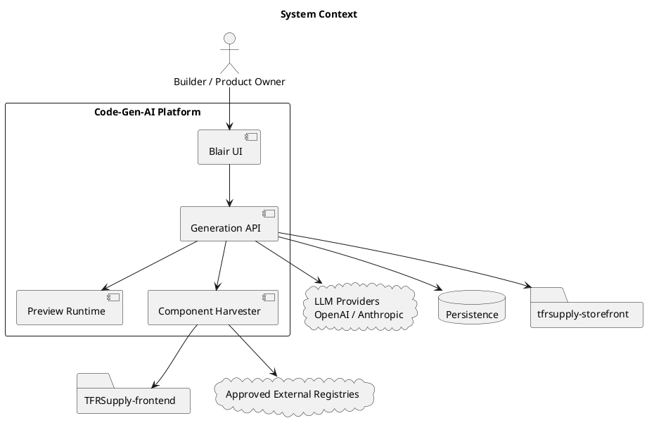
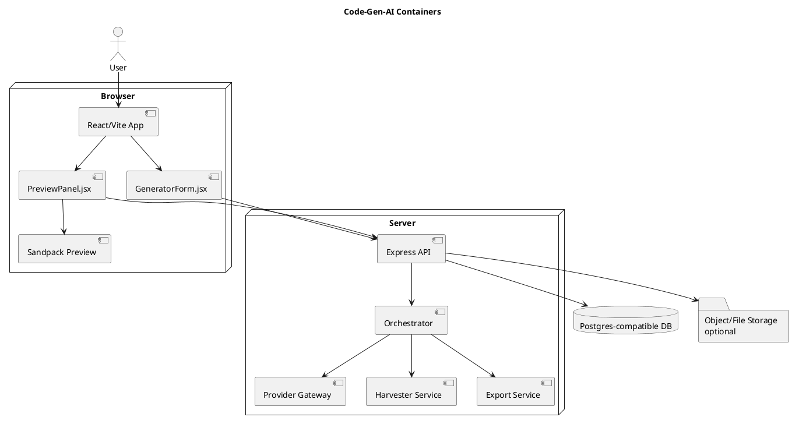
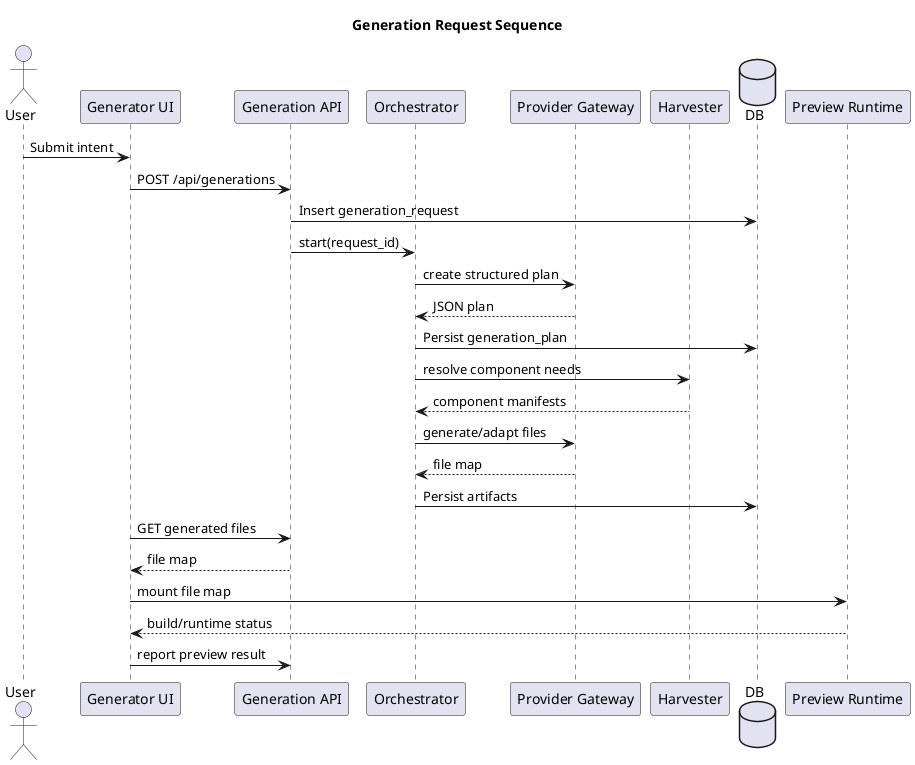

# System Architecture

## System context

## Container view

## Frontend modules

| Module | Responsibility |
|---|---|
| `GeneratorForm.jsx` | Capture user intent and start generation |
| `PreviewPanel.jsx` | Render live preview and verification status |
| `FileTree.tsx` | Inspect generated files |
| `ReviewDrawer.tsx` | Approve/request changes/reject output |
| `GenerationTimeline.tsx` | Display lifecycle progress |
| `useGeneration.ts` | API calls and streaming state |
| `TfrsThemeProvider.tsx` | Theme tokens and shared classes |

## Backend modules

| Module | Responsibility |
|---|---|
| `routes/generations.ts` | Generation endpoints |
| `services/orchestrator/` | Lifecycle state machine |
| `services/providers/` | OpenAI/Anthropic/mock adapters |
| `services/harvester/` | Source search, scoring, extraction, adaptation |
| `services/preview/` | Preview bundle/file map creation |
| `services/export/` | ZIP, patch, branch bundle |
| `services/audit/` | Append-only audit trail |
| `db/` | Migrations and queries |

## Request lifecycle

## Trust boundaries

| Boundary | Trust level |
|---|---|
| Server API, provider gateway, database, audit log | Trusted |
| Generated files before review, preview logs, user prompt content | Semi-trusted |
| External component sources and raw model output | Untrusted |

## ADRs

- ADR-0001: Plan-first generation.
- ADR-0002: Sandpack MVP preview, WebContainers phase 2.
- ADR-0003: Radix/Shadcn-style component harvesting.
- ADR-0004: Server-side provider gateway.
- ADR-0005: Postgres-compatible persistence.
