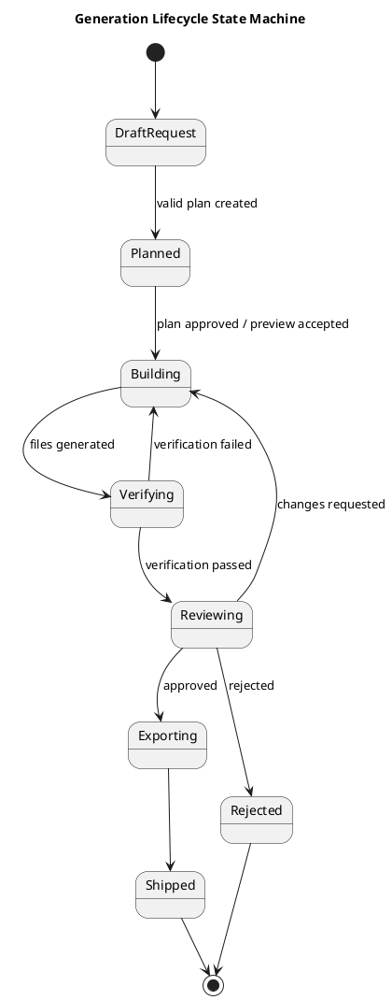

# Agent Lifecycle

## Purpose

The Agent Lifecycle prevents fragile one-shot generation. Blair must move through explicit phases and persist the result of each phase.

| Phase | Purpose | Required output |
|---|---|---|
| Define | Understand goal, users, constraints, target repo, data, integrations | `generation_request` |
| Plan | Produce structured implementation plan | `generation_plan` JSON |
| Build | Harvest/adapt components and generate files | `harvested_components`, `generated_artifacts` |
| Verify | Run validation, lint, type, tests, preview smoke | `verification_run` |
| Review | Human/AI review against acceptance criteria | `review_decision` |
| Ship | Export approved result | `export_job` |

## Define

Inputs:

- user prompt,
- target repository,
- target app/page/feature,
- design constraints,
- data entities,
- integrations,
- non-functional constraints.

Required behavior:

- State assumptions explicitly.
- Ask at most two blocking questions.
- Prefer safe defaults when possible.
- Do not write code during Define.

## Plan

The plan must match `contracts/plan.schema.json`.

Required plan fields:

- summary,
- assumptions,
- target,
- user stories,
- data model,
- routes,
- component needs,
- source strategy,
- file manifest,
- tasks,
- verification,
- risks,
- open questions.

Required behavior:

- Generate JSON first.
- Validate JSON before Build.
- Do not silently overwrite approved plans; create revisions.

## Build

Required behavior:

- Harvest components before custom UI.
- Use internal TFRSupply components first.
- Use Shadcn/Radix-style components next.
- Use GitHub only from allowlist or with review.
- Record source and license.
- Keep code modular and reviewable.

## Verify

Required checks:

| Check | MVP status |
|---|---|
| Schema validation | Required |
| Lint | Required |
| Type check | Required for TS |
| Unit tests | Required for logic/adapters |
| Preview boot | Required |
| Console error scan | Required |
| Accessibility smoke | Should |
| License check | Should |

## Review

Reviewer decisions:

- `approved`
- `changes_requested`
- `rejected`

Checklist:

- Matches request.
- Follows TFRS design.
- Components sourced/licensed.
- Dependencies minimal.
- Data structures defined before UI.
- Preview boots.
- Tests/checks pass.

## Ship

MVP export options:

- ZIP file.
- Git patch.
- Review bundle.

Later:

- branch creation,
- PR creation,
- preview link,
- generated screenshots.

## State machine

## Transition rules

| From | To | Required condition |
|---|---|---|
| DraftRequest | Planned | Plan validates |
| Planned | Building | Plan ID is persisted/current |
| Building | Verifying | At least one artifact exists |
| Verifying | Building | Repair task created |
| Verifying | Reviewing | Required checks pass |
| Reviewing | Exporting | Human approval |
| Exporting | Shipped | Export artifact created |
