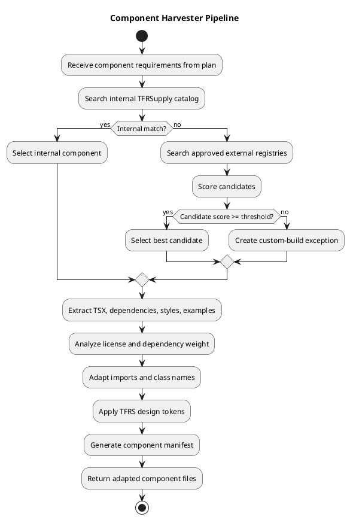

# Component Harvester

## Purpose

The Component Harvester prevents Blair from inventing complex UI from scratch when reusable components already exist.

Rule:

> Harvest first. Adapt second. Generate custom code only with an explicit exception.

## Source priority

1. `TFRSupply-frontend` internal components.
2. Approved Base44-style starter/template components.
3. Shadcn/Radix-style components.
4. GitHub allowlist sources.
5. Custom implementation exception.

## Pipeline



## Candidate scoring

| Signal | Weight |
|---|---:|
| Internal design-system match | 25 |
| Accessibility foundation | 15 |
| Dependency lightness | 15 |
| Tailwind compatibility | 15 |
| License clarity | 10 |
| Maintenance signal | 10 |
| Adaptation effort | 10 |

Score rules:

- `80+`: selectable if license is allowed.
- `65-79`: selectable with review note.
- `<65`: requires exception or architect approval.

## Component requirement shape

```json
{
  "id": "comp_need_hero_001",
  "name": "TacticalHero",
  "category": "marketing-section",
  "purpose": "Landing page hero with CTA and tactical grid",
  "requiredProps": ["title", "subtitle", "primaryCta"],
  "dataDependencies": [],
  "accessibilityNeeds": ["semantic h1", "keyboard accessible CTA"],
  "designNotes": ["deep navy background", "signal red CTA", "gold telemetry accents"]
}
```

## Manifest requirements

See `contracts/component-manifest.schema.json`.

Required fields:

- source type/name/url,
- license,
- original files,
- adapted files,
- added/removed dependencies,
- TFRS adaptations,
- risk notes,
- score.

## Adaptation rules

### Imports

- Use `@/components/ui/*` for local UI primitives.
- Use `@/lib/cn` for class merging.
- Avoid deep imports from copied third-party projects.

### Styling replacements

| Generic | TFRS replacement |
|---|---|
| `bg-white` | `bg-[#080d14]` or approved surface |
| `text-gray-*` | steel/ink tokens |
| `rounded-lg` | `rounded-sm` |
| `shadow-xl` | tactical border/glow |
| generic heading weight | `font-sans font-black uppercase tracking-wider` |
| muted metadata | `font-mono` with steel/gold accent |

### Dependencies

Allowed by default:

- `@radix-ui/react-*`
- `lucide-react`
- `framer-motion`
- `clsx`
- `tailwind-merge`
- `class-variance-authority`
- `react-hook-form`
- `zod`
- `@hookform/resolvers`
- `@tanstack/react-query`

Requires review:

- charting libraries,
- rich text editors,
- drag-and-drop packages,
- date libraries,
- native bindings.

Disallowed by default:

- MUI,
- Bootstrap,
- Ant Design,
- Chakra UI,
- unclear-license packages.

## Custom-build exception

```md
# Custom Component Exception

component_need_id:
requested_component:
reason_no_harvested_component_fit:
searched_sources:
selected_approach:
estimated_complexity:
reviewer_approval:
```

## MVP interfaces

```ts
export interface ComponentRegistryAdapter {
  name: string;
  search(requirement: ComponentRequirement): Promise<ComponentCandidate[]>;
  fetch(candidate: ComponentCandidate): Promise<ComponentSourceBundle>;
}

export interface ComponentHarvester {
  resolve(requirements: ComponentRequirement[]): Promise<HarvestResult>;
}
```

## Tests

1. Internal component is selected before external.
2. Radix dialog selected for modal requirement.
3. MUI component rejected.
4. Missing license marked review required.
5. TFRS class adaptation applied.
6. Manifest validates.
