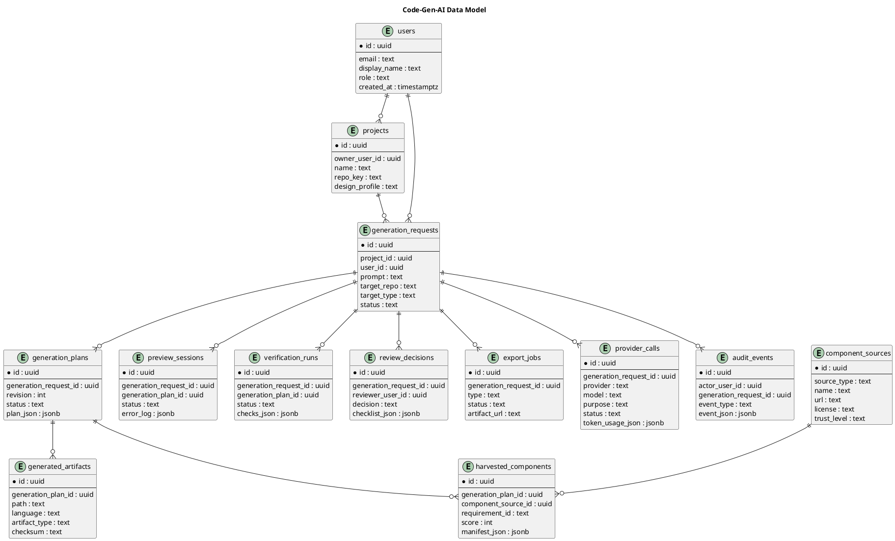

# Data Model

## Target

Use a Postgres-compatible relational schema for traceability, auditability, and review workflows.

## Entities



## SQL starter schema

```sql
create table users (
  id uuid primary key,
  email text unique not null,
  display_name text not null,
  role text not null default 'developer',
  created_at timestamptz not null default now()
);

create table projects (
  id uuid primary key,
  owner_user_id uuid not null references users(id),
  name text not null,
  repo_key text not null check (repo_key in ('Code-Gen-AI', 'TFRSupply-frontend', 'tfrsupply-storefront')),
  design_profile text not null default 'tfrs-tactical-command-deck',
  created_at timestamptz not null default now()
);

create table generation_requests (
  id uuid primary key,
  project_id uuid not null references projects(id),
  user_id uuid not null references users(id),
  prompt text not null,
  target_repo text not null,
  target_type text not null check (target_type in ('app', 'page', 'component', 'feature', 'repair')),
  status text not null default 'draft_request',
  created_at timestamptz not null default now(),
  updated_at timestamptz not null default now()
);

create table generation_plans (
  id uuid primary key,
  generation_request_id uuid not null references generation_requests(id) on delete cascade,
  revision int not null,
  status text not null default 'draft',
  plan_json jsonb not null,
  validation_errors jsonb,
  created_at timestamptz not null default now(),
  unique (generation_request_id, revision)
);

create table component_sources (
  id uuid primary key,
  source_type text not null,
  name text not null,
  url text,
  license text,
  trust_level text not null default 'review_required',
  metadata_json jsonb not null default '{}'::jsonb,
  created_at timestamptz not null default now()
);

create table harvested_components (
  id uuid primary key,
  generation_plan_id uuid not null references generation_plans(id) on delete cascade,
  component_source_id uuid references component_sources(id),
  requirement_id text not null,
  score int not null check (score >= 0 and score <= 100),
  manifest_json jsonb not null,
  created_at timestamptz not null default now()
);

create table generated_artifacts (
  id uuid primary key,
  generation_plan_id uuid not null references generation_plans(id) on delete cascade,
  path text not null,
  language text not null,
  artifact_type text not null,
  content text not null,
  checksum text not null,
  created_at timestamptz not null default now(),
  unique (generation_plan_id, path)
);

create table preview_sessions (
  id uuid primary key,
  generation_request_id uuid not null references generation_requests(id) on delete cascade,
  generation_plan_id uuid references generation_plans(id),
  status text not null default 'created',
  preview_bundle_json jsonb,
  error_log jsonb not null default '[]'::jsonb,
  created_at timestamptz not null default now()
);

create table verification_runs (
  id uuid primary key,
  generation_request_id uuid not null references generation_requests(id) on delete cascade,
  generation_plan_id uuid references generation_plans(id),
  status text not null,
  checks_json jsonb not null,
  created_at timestamptz not null default now()
);

create table review_decisions (
  id uuid primary key,
  generation_request_id uuid not null references generation_requests(id) on delete cascade,
  reviewer_user_id uuid not null references users(id),
  decision text not null check (decision in ('approved', 'changes_requested', 'rejected')),
  notes text,
  checklist_json jsonb not null default '{}'::jsonb,
  created_at timestamptz not null default now()
);

create table export_jobs (
  id uuid primary key,
  generation_request_id uuid not null references generation_requests(id) on delete cascade,
  type text not null check (type in ('zip', 'git_patch', 'branch_pr')),
  status text not null default 'queued',
  artifact_url text,
  metadata_json jsonb not null default '{}'::jsonb,
  created_at timestamptz not null default now()
);

create table provider_calls (
  id uuid primary key,
  generation_request_id uuid references generation_requests(id) on delete set null,
  provider text not null,
  model text not null,
  purpose text not null,
  status text not null,
  latency_ms int,
  token_usage_json jsonb,
  request_hash text,
  response_hash text,
  error_code text,
  created_at timestamptz not null default now()
);

create table audit_events (
  id uuid primary key,
  actor_user_id uuid references users(id),
  generation_request_id uuid references generation_requests(id) on delete set null,
  event_type text not null,
  event_json jsonb not null default '{}'::jsonb,
  created_at timestamptz not null default now()
);
```

## Statuses

Generation status:

- `draft_request`
- `planning`
- `planned`
- `building`
- `verifying`
- `reviewing`
- `approved`
- `exporting`
- `shipped`
- `failed`
- `rejected`

Provider call purpose:

- `define`
- `plan`
- `component_search_query`
- `generate_files`
- `repair_files`
- `review`
- `summarize`

## Retention

- Keep artifacts per project until deleted.
- Keep provider metadata.
- Store raw provider content only if explicit debug mode is enabled.
- Redact secrets before persistence.
- Never delete audit events.
