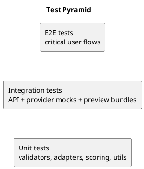

# Testing and Quality Gates

## Goals

Generated code must be structured, safe, previewable, and aligned with the plan before review.

## Test pyramid

## Required checks

| Artifact | Required checks |
|---|---|
| Generation request | JSON schema validation |
| Generation plan | JSON schema validation and lifecycle completeness |
| Component manifest | JSON schema validation, license, dependency diff |
| Generated source | Lint, type check, import resolution |
| Generated UI | Preview boot, console error scan, design checklist |
| Export bundle | Manifest, checksum, approval record |

## Unit tests

- Orchestrator state transitions.
- Provider gateway output validation and error normalization.
- Harvester source priority and scoring.
- TFRS design adapter class replacement.
- Export approval guard.
- Secret redaction.

## Integration tests

- `POST /api/generations` persists request.
- Plan creation persists valid plan.
- Invalid plan returns `VALIDATION_FAILED`.
- Build requires valid plan.
- Preview bundle endpoint returns files/dependencies.
- Export requires approval.

## E2E MVP flow

1. User requests tactical landing page.
2. Blair generates valid plan.
3. Harvester selects components.
4. Preview boots.
5. User requests change.
6. Blair repairs files.
7. Reviewer approves.
8. User exports ZIP.

## Quality gates

### Gate 1 — Plan readiness

- Plan schema valid.
- Data model defined.
- Routes/components listed.
- Verification checks listed.
- Risks listed.

### Gate 2 — Build readiness

- File paths valid.
- Imports resolve or are mocked.
- Dependency manifest present.
- Component manifests valid.

### Gate 3 — Preview readiness

- Preview bundle created.
- Preview boots or failure is shown.
- Runtime errors captured.
- Mock data present.

### Gate 4 — Export readiness

- Reviewer approved.
- Verification summary attached.
- Dependency diff attached.
- Component manifests attached.
- Checksums generated.

## Suggested tooling

| Concern | Tool |
|---|---|
| Unit/integration tests | Vitest |
| React component tests | Testing Library |
| E2E | Playwright |
| Lint | ESLint |
| Format | Prettier |
| Type check | TypeScript |
| Schema validation | Zod |
| Accessibility smoke | axe-core / jest-axe |
| Secret scan | gitleaks or equivalent |

## Definition of done

- Plan is valid and approved.
- Components are harvested or exceptions documented.
- Generated files pass available checks.
- Preview boots or failure is documented.
- Review decision is approved.
- Export contains manifests, checksums, verification summary.
