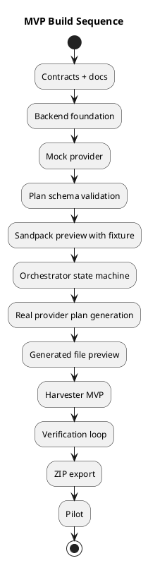

# Implementation Plan

## Guiding rule

Build the smallest system that enforces the lifecycle and produces a real live preview. Start with plan-first generation, persistence, and Sandpack preview.

## Workstream A — Contracts and documentation

1. Add documentation suite.
2. Add JSON schemas.
3. Add schema validation tests.
4. Add `CLAUDE.md`, Cursor rules, Copilot instructions.
5. Add ADRs.

Deliverables:

- docs committed,
- schemas in CI,
- AI tools aligned.

## Workstream B — Backend foundation

1. Create `server/` Express app.
2. Add environment config.
3. Add request ID middleware.
4. Add error envelope middleware.
5. Add health endpoint.
6. Add generation routes.
7. Add migrations.
8. Add audit service.

Suggested layout:

```text
server/
  index.ts
  app.ts
  config.ts
  middleware/
  routes/
  services/
  db/
```

Acceptance:

- `GET /api/health` works.
- `POST /api/generations` persists request.
- Audit event written.

## Workstream C — Provider gateway

1. Define gateway interface.
2. Implement mock provider.
3. Implement OpenAI adapter.
4. Implement Anthropic adapter.
5. Add structured plan prompt.
6. Validate outputs.
7. Log provider calls.
8. Add timeouts/retries.

Acceptance:

- Gateway returns valid plan.
- Invalid output rejected.
- Keys never reach frontend.

## Workstream D — Orchestrator

1. Implement lifecycle state machine.
2. Add plan creation.
3. Add plan approval.
4. Add build command.
5. Add verification command.
6. Add review command.
7. Add export guard.

Acceptance:

- Build blocked without valid plan.
- Export blocked without approval.
- State transitions audited.

## Workstream E — Preview

1. Replace static iframe with Sandpack.
2. Add preview bundle mapper.
3. Add dependency manifest handling.
4. Add mock data injection.
5. Capture preview errors.
6. Persist preview session.
7. Add preview smoke test.

Acceptance:

- Generated React renders live.
- Missing import error is visible and persisted.
- Preview contains no secrets.

## Workstream F — Harvester

1. Implement registry adapter interface.
2. Implement internal TFRSupply adapter.
3. Implement Shadcn/Radix adapter.
4. Implement GitHub allowlist adapter.
5. Score candidates.
6. Adapt TFRS classes.
7. Persist manifests.
8. Add custom exception path.

Acceptance:

- Internal preferred.
- Disallowed packages rejected.
- Manifests validate.

## Workstream G — Export

1. ZIP export.
2. Manifest bundle.
3. Checksums.
4. Git patch export.
5. Review gate.
6. Download endpoint.
7. Audit events.

Acceptance:

- Approved generation exports.
- Unapproved export blocked.
- Bundle includes plan, files, manifests, verification, review.

## Recommended sequence


